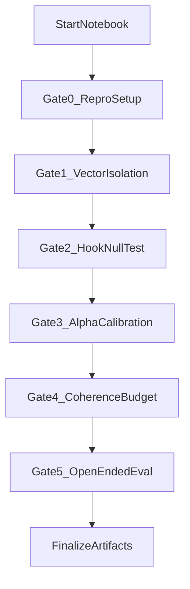

# Temporal Steering From-Scratch Plan (Collaborative Gates)

## Goal
Build a brand-new notebook for temporal steering that starts from zero, validates each component with explicit pass/fail checks, and proceeds one gate at a time only after your confirmation.

## Scope and Deliverables
- New notebook: `notebooks/08_steering_from_scratch.ipynb`
- This plan document as the execution contract
- Reproducible outputs under `out/experiments/steering_from_scratch/`

## New Model Requirement (Critical)
- This workflow assumes we may switch to a **different base model** at any time.
- Probe geometry is model-specific, so prior artifacts from another model are **reference only**.
- For a new model, you must:
  1. Recompute activations on the target dataset for that model.
  2. Retrain per-layer probes (all layers).
  3. Re-select `best_layer` from that model's probe curve.
  4. Recompute steering vectors (ITI-style and CAA-style) at that model's selected layer.
- Never carry over `best_layer` or `alpha` defaults from a previous model run without re-validation.

## Literature-Grounded Design Principles
- **Activation Engineering / ActAdd** (`arXiv:2308.10248`): derive steering from activation contrasts; avoid training-heavy methods.
- **Inference-Time Intervention / ITI** (`arXiv:2306.03341`): treat steering strength as a control knob and explicitly track behavior-quality tradeoffs.
- **Contrastive Activation Addition / CAA** (`arXiv:2312.06681`): build contrastive directions and verify both binary-choice and open-ended effects.

## Collaboration Protocol
1. Work gate-by-gate only.
2. Run one gate, report outputs, and wait for confirmation.
3. Do not proceed to the next gate if pass criteria fail.
4. Every gate prints a `STOP HERE` checklist.

## Execution Flow

## Gate 0 - Reproducible Setup
### Tasks
- Initialize deterministic environment (seeds, dtype, device).
- Load model with `ModelRunner` and print backend/model metadata.
- Validate required artifacts exist for the **current model**:
  - `probe_accuracies.csv` and `probe_layer_*.pkl` under a model-specific output directory, or
  - if missing, mark probe retraining as required before Gate 1.
- Create output directory `out/experiments/steering_from_scratch`.
- Save initial `run_metadata.json`.

### Pass Criteria
- All imports and model setup run cleanly.
- Model identity is recorded and artifact compatibility is validated.
- Metadata file written.

## Gate 1 - Verify and Isolate Steering Vector
### Tasks
- Load model-matched `probe_accuracies.csv` and select the intervention layer from first robust peak/plateau.
- Build two vectors:
  - **Method A (ITI-style):** normalized probe coefficient at chosen layer.
  - **Method B (CAA-style):** `mean(long_term) - mean(immediate)` at chosen layer.
- Run diagnostics:
  - shape is `[d_model]`
  - finite values only
  - pre/post normalization norms
  - cosine similarity between methods
- Choose active vector method for steering and save:
  - `steering_vector_unit.pt`
  - `steering_vector_meta.json`
  - include `model_name`, `backend`, `best_layer`, probe source path, and dataset source path.

### Pass Criteria
- Active vector has unit norm (within tolerance).
- Layer rationale logged and defensible from **current-model** probe curve.
- No NaN/Inf; dimension matches model `d_model`.

## Gate 2 - Minimal Hook and Null-Effect Test
### Tasks
- Implement raw hook at `blocks.{L}.hook_resid_post`.
- Support two modes:
  - `last_prompt_token_only`
  - `generated_tokens_only`
- Implement strict alpha-null verification:
  - unhooked logits vs hooked logits at `alpha=0`
  - assert `torch.allclose(..., atol=1e-5, rtol=1e-5)`
- Ensure hook path avoids cache pitfalls in generation.

### Pass Criteria
- Null test passes for all test prompts.
- Hook modifies only intended positions.
- No sequence-wide accidental perturbation.

## Gate 3 - Alpha Calibration via A/B Logits
### Tasks
- Define 5 calibration prompts with explicit `(A)` vs `(B)` next-token decisions.
- Sweep `alpha` over symmetric values (default `[-5, -2, -1, 0, 1, 2, 5]`).
- Record for each prompt and alpha:
  - `P(A)`, `P(B)`, `logit(B)-logit(A)`
- Plot mean `P(B)` and margin trends across alphas.
- Run monotonicity checks and print warnings if violated.

### Pass Criteria
- Positive alpha increases long-term preference trend.
- Negative alpha increases short-term preference trend.
- Curves are responsive (not flatline).

## Gate 4 - Coherence and Capability Budget
### Tasks
- Evaluate baseline vs steered on unrelated non-temporal prompts.
- Compute lightweight quality metrics:
  - repetition ratio
  - average token logprob proxy
- Print qualitative side-by-side generations.
- Select safe alpha budget (`alpha_long`, `alpha_short`) from Gate 3 + coherence checks.

### Pass Criteria
- Outputs remain coherent English.
- Quality degradation is bounded.
- Selected alphas recorded in metadata.

## Gate 5 - Open-Ended Temporal Evaluation
### Tasks
- Run 20 implicit temporal prompts without A/B options.
- Evaluate three conditions:
  - baseline (`alpha=0`)
  - short-term (`alpha<0`)
  - long-term (`alpha>0`)
- Save structured outputs:
  - `open_ended_results.json`
  - optional summary csv
- Include manual rubric scaffold and optional LLM-as-judge hook point.

### Pass Criteria
- Clear directional separation across three conditions.
- Results fully saved with reproducible config.

## Session Log Template (Use After Each Gate)
- Gate:
- Date/time:
- Key outputs:
- Pass/fail:
- If fail, hypothesis:
- Next action:

## Expected Artifacts
- `run_metadata.json`
- `steering_vector_unit.pt`
- `steering_vector_meta.json`
- `alpha_sweep_results.csv`
- `alpha_sweep_plot.png`
- `coherence_check_results.json`
- `open_ended_results.json`
- All artifact paths namespaced by model identifier to avoid cross-model contamination.
